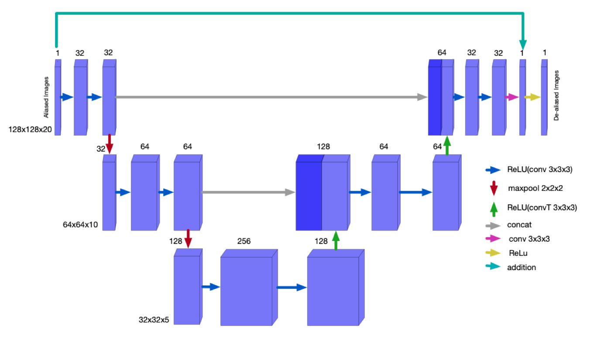

# The scripts for the model
This directory contains all the clean codes for the models commented and explained. To see them in action, check the Results directory

# Contents:
unet: scripts for the unet training

crnn: scritps for the crnn training

The other files are codes that I used to quantitatively assess the results (image_quality_metrics.py) and loading the checkpoints 
(model_checkpoint_loader.py)

## U-net architecture

## CRNN architecture
Figure taken from Convolutional Recurrent Neural Networks for Dynamic MR Image Reconstruction
Chen Qin, Jo Schlemper, Jose Caballero, Anthony Price, Joseph V. Hajnal, Daniel Rueckert

