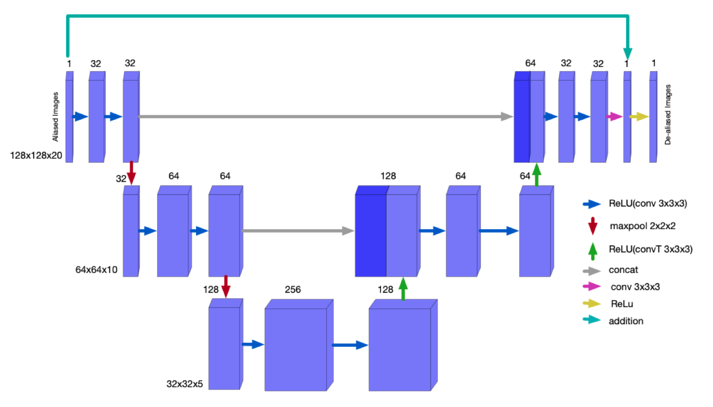
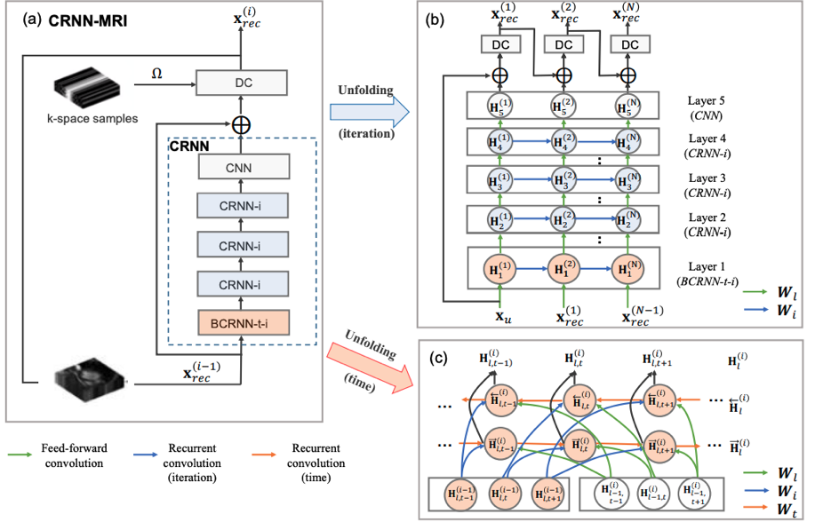
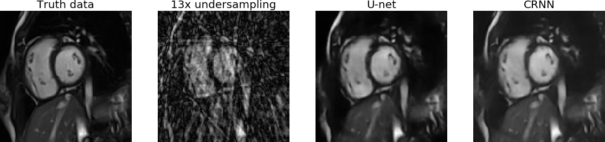
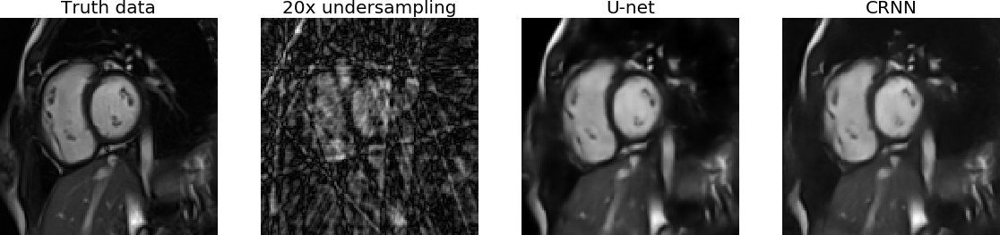
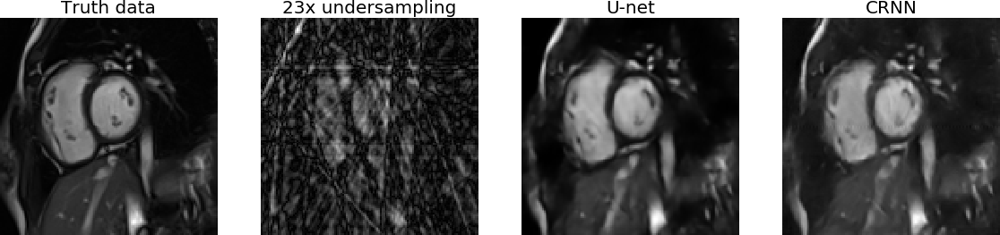

# Improving deep-learning methods for inverse problems
This repository contains my codes and jupyter notebooks showing the results of my models.
This code is part of MSc Scientific computing final project.
I implemented two deep-learning models in PyTorch: U-net and convolutional recurrent neural network (CRNN).
I used jupyter notebooks in the Google cloud for training of all the models, so there was no command line interface used.

### Contents
Models: Contatins the scripts for our models, the training loop scripts. 

Results: Contatins the jupyter notebooks that trained and tested the networks.

Data: Contatins the Matlab scripts for genereating the synthetic training data. Note that I did not put the actual data-set used, since they are medical and there are many complicated issues if I shared them. Also, the gridding file which has all the code for the gridding is not provided, this is because the file was too large for github and it seems to be proprietary code, so I chose not to actually put it there.

### Dependencies:
See `REQUIREMENTS.txt` for a list of dependencies.

### Instructions:
I did all the training and and assessment fo the results in the Google's cloud. I used jupyter notebooks. Each time, I load and prepare the results manually. This is because there was different data coming from different sources each one having some different shapes. This was the best approach to avoid making mistakes that can cause hours of GPU time or give bad results because the data is not in the correct shape.

## U-net architecture

Architecture of the residual U-net used for spatio-temporal de-aliasing. The network is fed with aliased images and outputs the de-aliased images at the end. The numbers at the top of the purple cubes indicate the number of channels for each layer. The image resolution at each level is shown at the bottom left of each layer. Every convolution uses a ReLU non-linearity (blue arrow)

## CRNN architecture
Figure taken from Convolutional Recurrent Neural Networks for Dynamic MR Image Reconstruction
Chen Qin, Jo Schlemper, Jose Caballero, Anthony Price, Joseph V. Hajnal, Daniel Rueckert

Architecture of the CRNN-MRI network for MRI reconstruction. Structure of the network when unfolded over the iterations. Structure of the BCRNN- t-i when unrolled over the time steps. Green arrows denote the feed-forward convolutions denoted by Wl . Blue arrows and red arrows denote the recurrent convolutions over iterations and the time-steps respectively. Note that in imple- mentation the weights are independent across layers, but here we used a single notation to denote weights of convolutions at different layers for the sake of simplicity.

### Results:

### References
-"Real‐time cardiovascular MR with spatio‐temporal artifact suppression using deep learning–proof of concept in congenital heart disease".
Andreas Hauptmann  Simon Arridge  Felix Lucka  Vivek Muthurangu  Jennifer A. Steeden

-"Convolutional Recurrent Neural Networks for Dynamic MR Image Reconstruction".
Chen Qin, Jo Schlemper, Jose Caballero, Anthony Price, Joseph V. Hajnal, Daniel Rueckert
