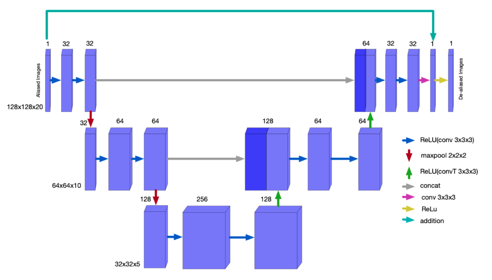
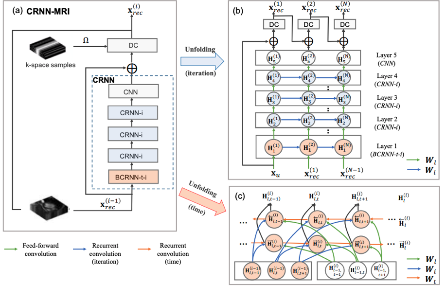

# The scripts for the model
These are the clean versions of the model parts. 

# Contents:

## U-net architecture

## CRNN architecture
Figure taken from Convolutional Recurrent Neural Networks for Dynamic MR Image Reconstruction
Chen Qin, Jo Schlemper, Jose Caballero, Anthony Price, Joseph V. Hajnal, Daniel Rueckert

